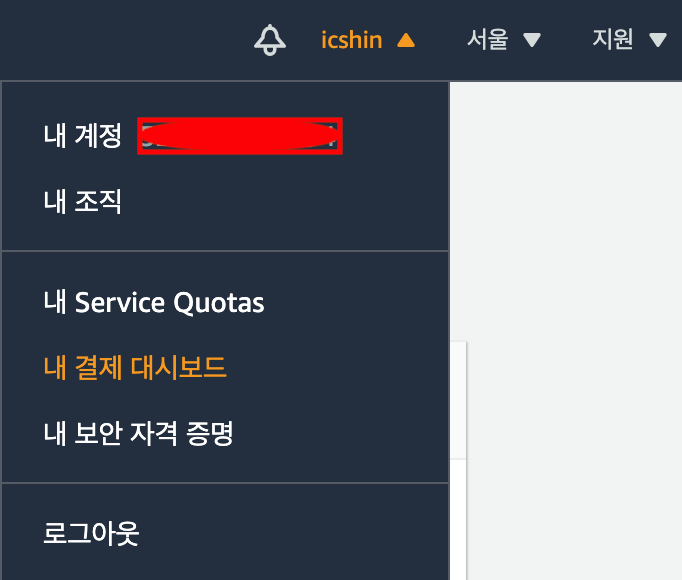
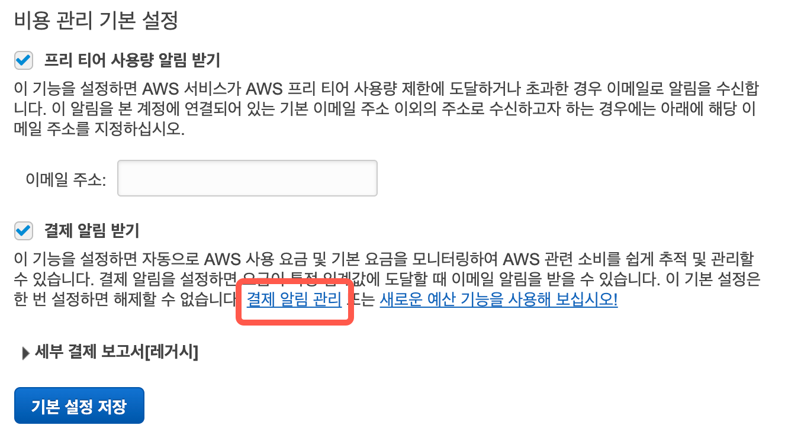
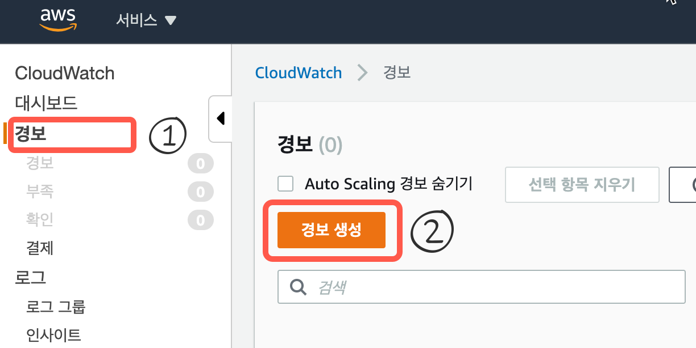
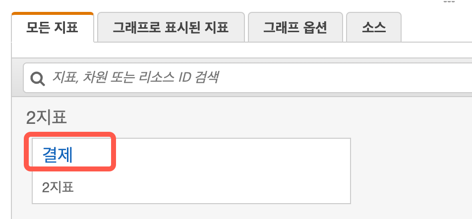
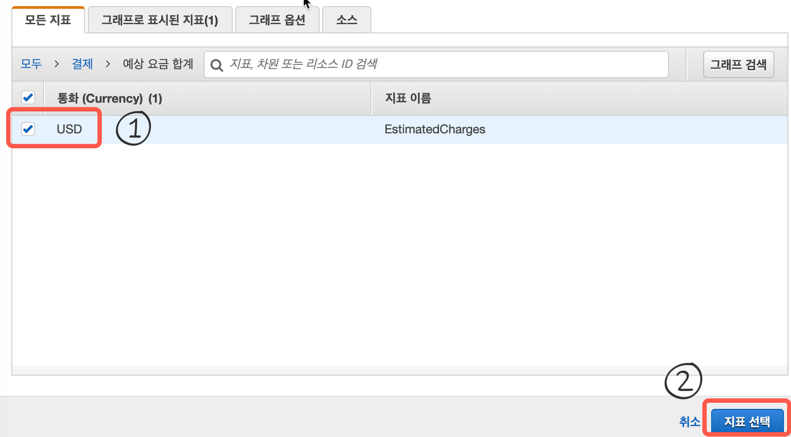
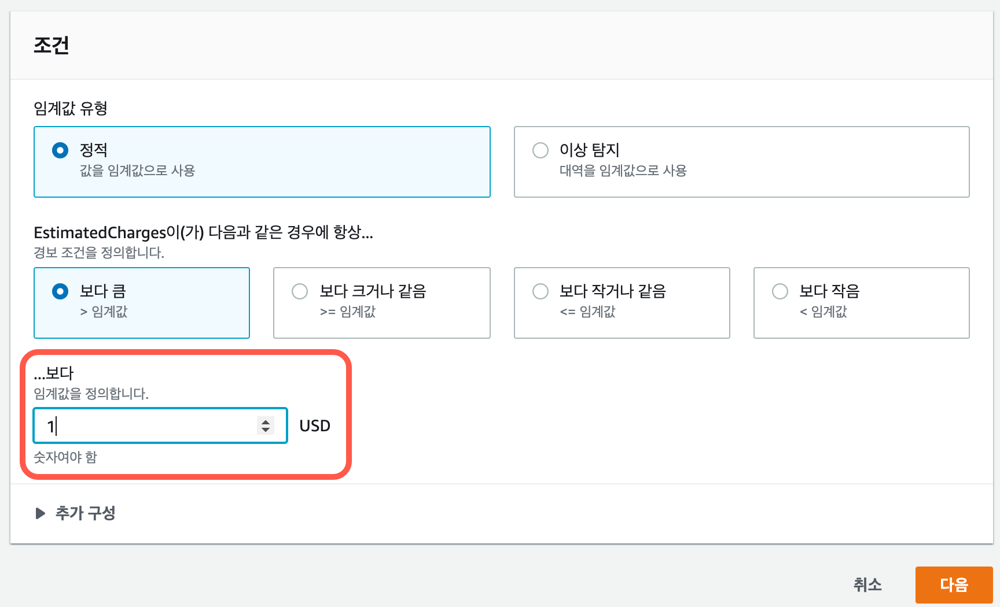
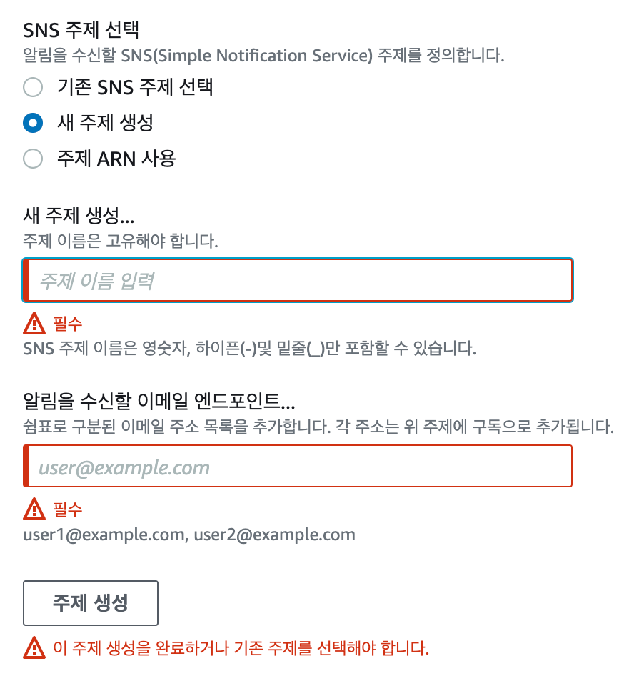
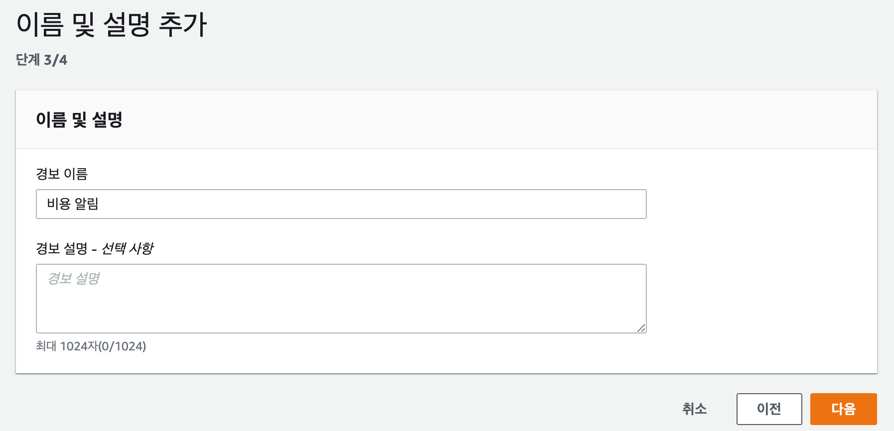

# 비용 알림 설정

1. 비용 알림 설정
2. 클라우드 워치
  1. 작업 구성 (2/4)
  2. 이름 및 설명 (3/4)
  3. 미리 보기 및 생성 (4/4)

## 비용 알림 설정
AWS 프리티어는 1년간 무료이지만 주어진 용량을 초과해서 사용하는 경우 과금됩니다. 특히 여러분이 의도하지 않은 상태에서 AWS 자원을 사용하고 이로인해 과금이 될 수도 있는데 이러한 경우를 방지하기 위하여 비용 관리 알림 설정을 해두는 것이 좋습니다.

루트 계정으로 로그인 한 후 '내 결제 대시보드'를 클릭합니다.

다음과 같이 '프리 티어 사용량 알림 받기'와 '결제 알림 받기'에 모두 체크한 후 기본 설정 저장을 클릭합니다.

## 클라우드 워치
위 그림에서 결제 알림 받기에서 '결재 알림 관리' 링크를 클릭하면 클라우드 워치로 이동합니다. 경보 메뉴를 선택한 후 경보 생성을 클릭합니다.

지표 선택을 클릭합니다.

예상 요금 합계 메뉴를 클릭합니다. 통화에 'USD'를 체크한 후 지표 선택을 클릭합니다.

임계값을 1 달러로 설정한 후 다음을 클릭합니다. 6시간에 1달러를 초과하여 과금되는 경우 알림이 발생합니다.

작업 구성 (2/4)
SNS 주제 선택에서 새 주제 생성을 클릭한 후 전송 받을 이메일을 입력합니다. 주제 생성을 클릭합니다. 설정이 완료됐다면 다음을 클릭합니다.

이름 및 설명 (3/4)
경보 이름을 입력한 후 다음을 클릭합니다.

미리 보기 및 생성 (4/4)
앞서 설정한 값들을 확인합니다. 이상이 없다면 '경보 생성'을 클릭하여 비용에 대한 경보를 생성합니다.