# AWS 계정 만들기

## 절차
aws의 계정 생성 단계는 총 5단계로 이루어져 있다. 

1. 계정 정보 입력  
2. 사용자 주소 입력  
3. 신용 카드 등록  
4. 핸드폰 인증  
5. aws의 사용 방식

### 1. 계정 정보 입력
AWS는 email을 통한 로그인을 지원합니다.

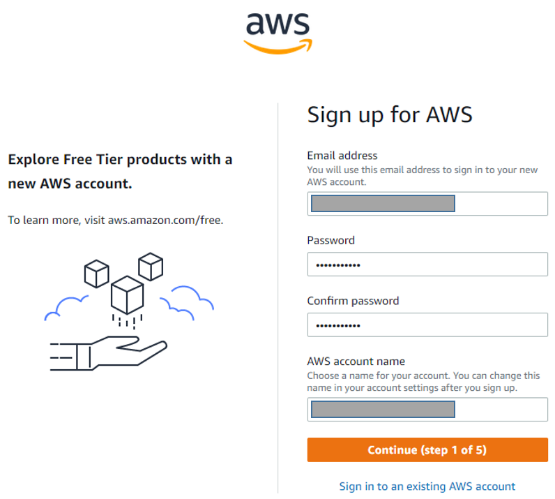

항목 | 설명
--- | ---
Email  | 개인이 가지고 있는 email 아무거나 입력 
Password | Email에서 사용하는 passwd가 아닌 새로운 패스워드 
Confirm password | Password 재 입력
AWS account name | 계정 별칭
 
### 2. 사용자 주소 입력

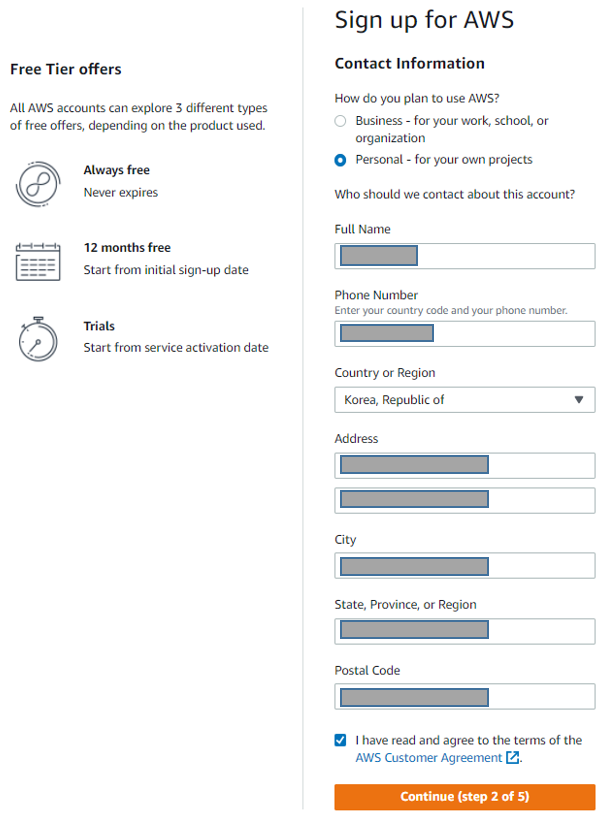

항목 | 설명
--- | ---
Contact information | AWS 어떻게 사용할 계획인가? 개인 용도로 사용 할 것 이기때문에 Personal 선택
Full Name | 영문 이름 (hong gil dong)
Phone Number | 전화 번호
country or region | korea, Republic of 
Address | 2개의 항목으로 나눠져 있습니다.   영어 주소로 적습니다. https://www.jusoen.com/ 여기서 영어로 주소 찾으면 됩니다.   첫번째칸 : ' 지역구' 까지만 적습니다(시도 까지 적으면 글자수 제한 때문에 안됩니다)   두번째칸 : 아파트면 동호수, 또는 로명 (아무렇게나 적어도 넘어감)   Ex) floor 3
City | 사는 곳의 '시'   Ex) Seoul
State, Province, or Region | 사는 곳의 '도'  EX)Seoul
Postal Code | 우편 번호 

### 3. 신용 카드 등록

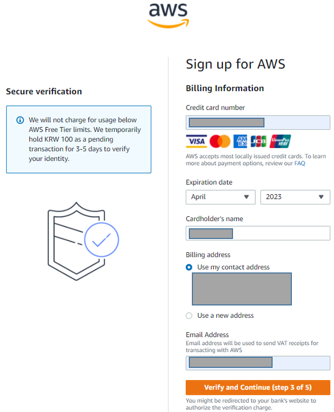

### 총 2단계로 나눠서 진행됩니다.

이 과정에서 100원이 승인되었다가 바로 취소됩니다. 결제 잘되는지 간 보는 겁니다. 언제든지 너희 지갑을 내가 털어 갈 수 있다는 의미

- 신용 카드 등록 1단계 : 카드 정보 입력

AWS는 과금이 철저하기 때문에 역시 신용카드 정보를 입력해야 합니다. 

항목 | 설명
--- | ---
credit card number | 신용카드 번호
Expiration date | 만기 월/년
Cardholder's name | 카드 소유주 이름
Billing address | 비용 청구 주소   - use my contract address   내 집 주소를 사용 하겠다 선택 
Email address | 거래 영수증을 받아볼 email 주소

- 신용 카드 등록 2단계 : 카드 결제를 위한 비밀 번호 입력

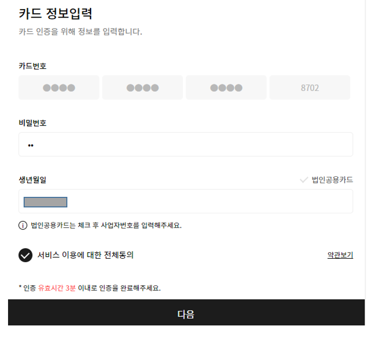

### 4. 핸드폰 인증 
사용자의 신원을 확인하는 단계로 총 2단계로 진행됩니다. 

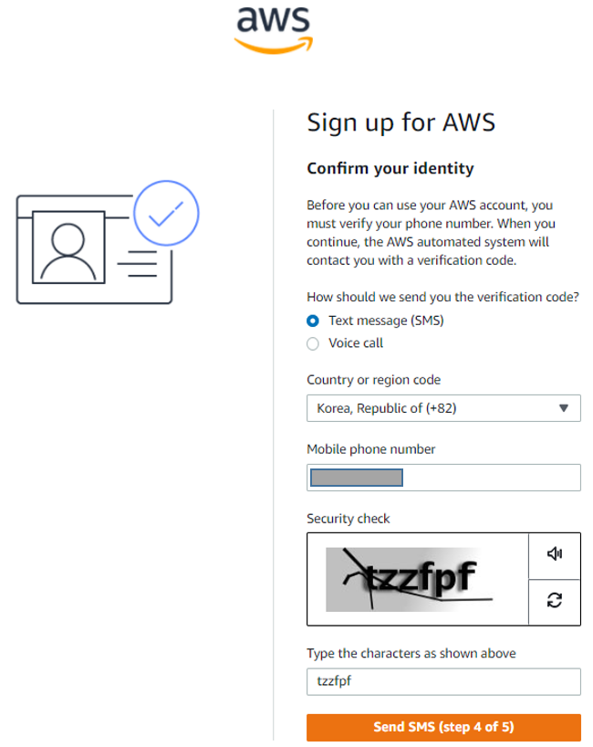

- 핸드폰 인증 1단계 : 신원 확인을 위한 휴대폰 정보 입력

항목 | 설명
--- | ---
How should we send you   the verification code | 어떤 방식으로 검증 코드를 보낼지 선택 해라.   - Text message(SMS) 선택 합니다. 
Country or region code | 국카 코드   - Korea, Republic of (+82) 
Mobile phone number | 전화 번호 
security check | 보안 문자 체크

- 핸드폰 인증 2단계 : 인증 문자 확인 

- 휴대전화로 온 인증 문자를 입력하면 끝입니다.

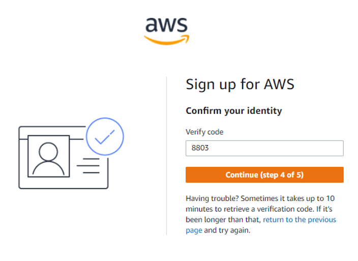

5. AWS의 지원 방식
AWS의 지원 방식을 물어봅니다. 

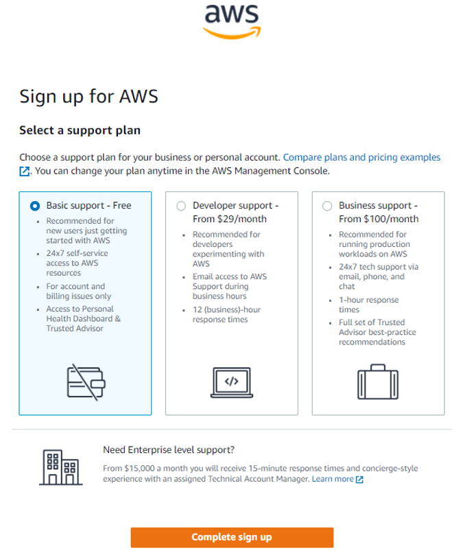

사용방식 | 지원 범위
------ | ------
Basic support - Free | - 신규 사용자에게 추천   - 언제든지 aws resource에 접근 가능   - 계정 및 결제 문제만 지원   - Personal Health Dashboard와 Trusted Advisor 접근 가능
Developer support - From $29/month | - 개발자 또는 숙력자에게 적합   - email를 통하여 aws support에게 근무시간 동안 도움 받을수 있습니다.   - 12시간안에 응답 받을수 있음(맞게 이해 한건지..)
Business support - From $100/month | - AWS에서 제품을 운영 할 때 사용   - 언제든지 email, phone, chat을 통해서 기술 지원 받을수 있음   - 1시간 안에 응답옴   - Trusted Advisor의 모범 사례 전체 세트를 지원

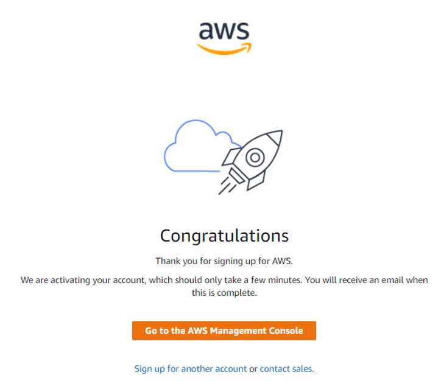
 
## 로그인을 해봅시다. 
1. [AWS Console 로그인](https://console.aws.amazon.com/console/home?region=ap-northeast-2) --> "루트 사용자"를 선택. 

    - IAM 사용자가 뭔지는 다음 포트스에서 알아보겠습니다.

2. 루트 사용자 이메일 주소 

    - 1 계정 정보 입력에서 사용한 email 주소를 사용합니다. 

 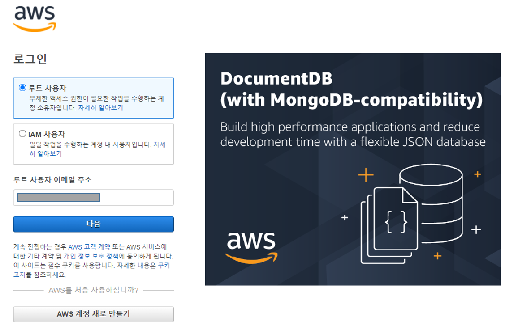

3. 보안 문자 입력

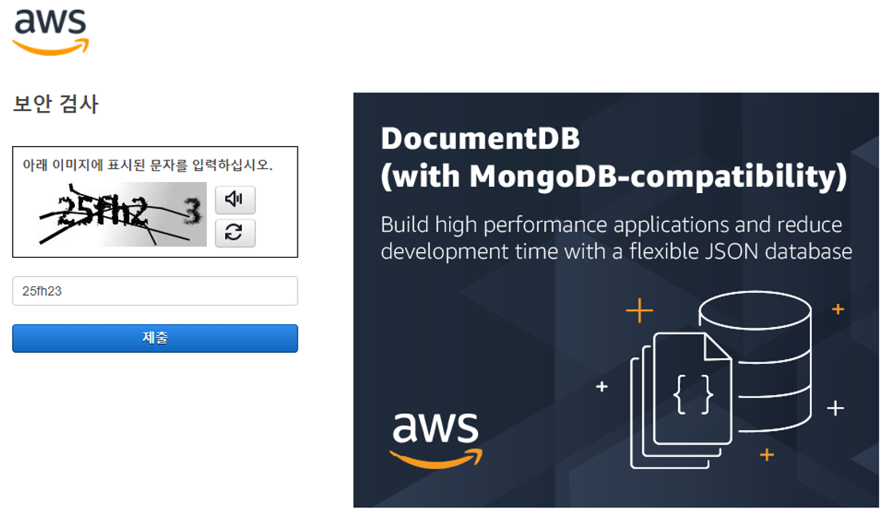
 
4. 비번 입력

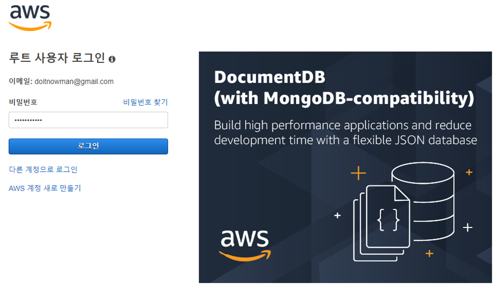

