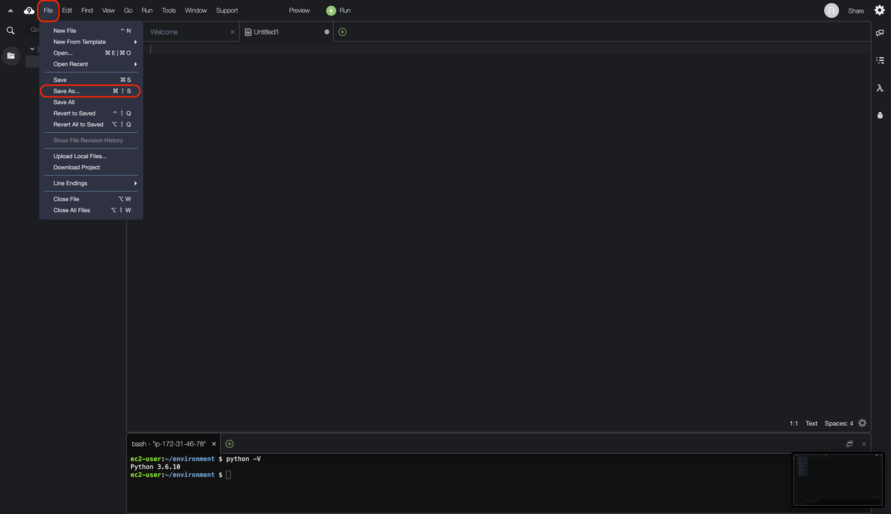

# 목차
[1. 개요](#1.개요)  
[2. AWS Cloud9를 시작](#2.-AWS-Cloud9를-시작)  
[3. AWS Cloud9에서 Python을 사용해 본다](#3.-AWS-Cloud9에서-Python을-사용해-본다)

# 1. 개요
개발 환경이 갖고 싶지만 일일이 Server 설정을하는 것이 불편하네요.
그런 당신에게 편리한 것이 AWS Cloud9입니다.

Server의 설정없이 갑자기 코드를 쓰기 시작합니다!

참조 : AWS Cloud9 (https://aws.amazon.com/cloud9/)
> AWS Cloud9 브라우저에서만 코드를 작성, 실행, 디버깅 할 클라우드 기반의 통합 개발 환경 (IDE)입니다.
여기에는 코드 편집기, 디버거, 터미널이 포함되어 있습니다. Cloud9는 JavaScript, Python, PHP 등의 일반적인 프로그래밍 언어에 필수적인 도구가 미리 패키지화되어 있기 때문에 새로운 프로젝트를 시작하기 위해 파일을 설치하거나 개발 시스템을 구성 할 필요 는 없습니다.


# 2. AWS Cloud9를 시작
- AWS 계정을 가지고 있지 않은 분은 아래 [AWS 무료 계정을 만드는 방법](https://aws.amazon.com/ko/premiumsupport/knowledge-center/create-and-activate-aws-account/) 참고하여 만들어보세요.
[AWS 무료 계정을 만드는 방법](https://aws.amazon.com/ko/premiumsupport/knowledge-center/create-and-activate-aws-account/)

## 2-1. AWS 관리 콘솔에 Login하기
- 아래의 URL에 액세스하는 https://console.aws.amazon.com/cloud9

## 2-2. Region 변경 (필요한 경우)
- 개인적으로는 Region은 가까운 Seoul 을 선택합니다

## 2-3. Cloud9을 클릭
- 왼쪽 상단에있는 "서비스"에서 Cloud 9 을 선택합니다. 하단으로 스크롤하면 "개발자 도구" 대신에 "Cloud9" 을 찾아서 선택합니다.

## 2-4. Cloud9 환경을 생성
- "Create environment"을 선택합니다.

- 어떤 용도의 Cloud9 환경 인지 알 수 있듯이, 'Name'과 'Description (옵션)" 를 입력하고 "Next step "을 클릭

- 환경 설정  화면으로 이동합니다.

- 각자의 환경에 맞게 설정하기

- 이번에는 무료 범위에서 Demo를 원하기 때문에 "t2.micro" 인스턴스를 선택. 또한 OS는 Linux 계이면 특별히 고집이 아니기 때문에 "Amazon Linux2"를 선택

- Cost-saving setting은 뒤에서 처리를 돌리고 싶을 때도 있기 때문에 연결하지 않을 때 마음대로 Down되면 곤란하므로 "Never"을 설정

- 설정에 최종 확인하고 "Create environent"을 클릭

- 이런 식으로, Cloud9 환경을 만들어 준다 (2-3 분이 상태에서 기다리는)

Cloud9 환경 완성!

# 3. AWS Cloud9에서 Python을 사용해 본다
## 3-1. bash에서 python의 Version을 확인해 보니
하단의 Console 화면에서 다음 명령을 입력
2020-07-10 시점에서는 Python 3.6.10이 Default로 설정

```bash : Terminal
python -V
```


탭에서도 terminal 화면을 열 수 있습니다


## 3-2. python 파일을 작성
탭의 "+"를 눌러 New File을 작성


"File"-> "Save as"를 클릭


적당한 이름을 설정하고 "save"를 클릭

각 Code 작성

이번에는 테스트 용이므로 아래의 Code를 작성하고 실행

```python : qiita_python.py
print ( 'hello world')
a = 1 + 2 - 3 * 4 
print (a)
```


## 3-3. 만든 Demo 용 python을 실행
`Run` 을 클릭


# 정리
이런 느낌으로 AWS Cloud9은 개발 환경을 쉽게 만들 수 있기 때문에 매우 추천합니다
꼭 여러분도 Try 해보세요
