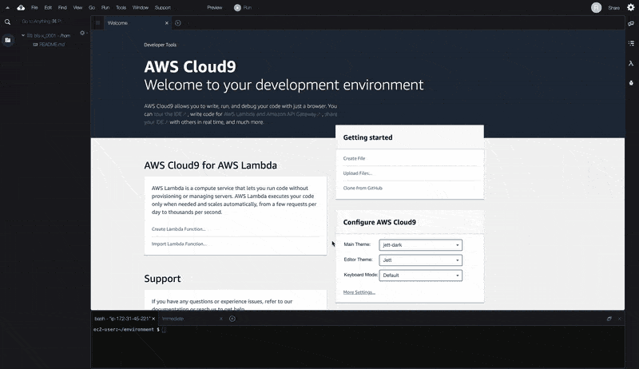
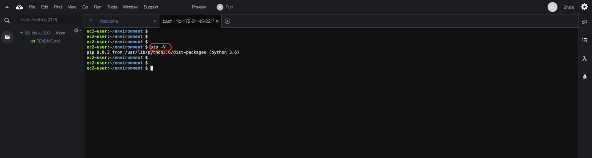
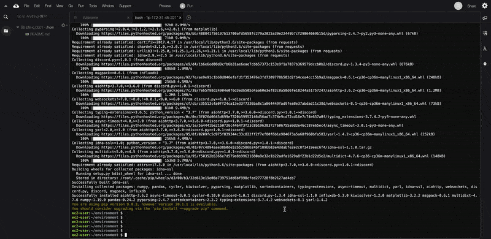
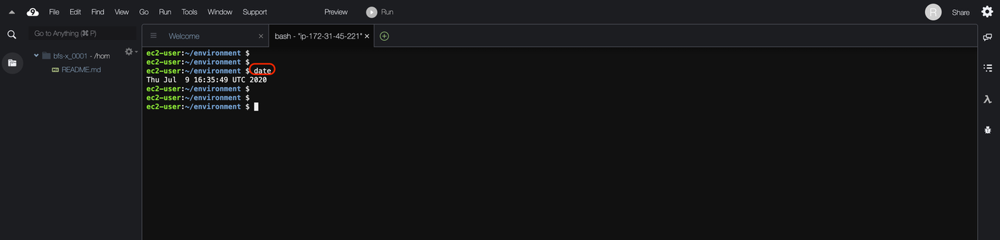

# 목차
[1. 개요](#1.개요)  
[2. pip install 대해](#2.pip-install-대해)  
[3. Cloud9의 환경에서 시간 변경](#3.Cloud9의-환경에서-시간-변경)

## 1. 개요
"[Amazon EC2 인스턴스에 AWS Cloud9 개발 환경 만들기](./01.AWS-cloud9-IDE-Python.md)"에서
Cloud9 환경 구축 방법에 대해 설명했지만,보다 세세한 python 환경을 정돈하기위한 방법을 설명한다.
이번에는 python 용 module을 넣는 방법 (pip install)와 Cloud9 측의 시각 환경을 변경하는 방법을 설명한다.


## 2. pip 설치
python을 사용하게되면, pip install 등에서 사용하고 싶은 Module을 넣고 싶어진다.
그 방법에 대해 정리해보겠습니다.

### 2-1. Cloud9 환경을 생성
Cloud9 환경을 작성하지 않은 사람은, [Amazon EC2 인스턴스에 AWS Cloud9 개발 환경 만들기](./01.AWS-cloud9-IDE-Python.md)를 참고로 만들어보세요


### 2-2. Terminal을 시작할
화면 위에서 탭의 "+"를 클릭 "New Terminal"을 클릭합니다.



### 2-3. pip 확인

```bash : 터미널
pip -V
```

이전에 `pip install` 이 되어 있는지 확인합니다.



### 2-4. pip 설치

Cloud9 환경에서 `pip install` 명령을 관리자 권한으로 실행하지 않도록 합니다.
Cloud9 환경에서 `sudo` 암호는 설정되어 있지 않기 때문에, 그대로 실행할 수 있습니다.

```bash : 터미널
sudo pip install <install하고 싶은 module>
```


pip 자신의 version 오래된 때문에 pip를 upgrade하기

```bash : 터미널
sudo pip install --upgrade pip
```




## 3. Cloud9의 환경에서 시간 변경

### 3-1. 시간 확인

```bash : 터미널
date
```
Cloud9의 Default 설정은 UTC 입니다.



### 3-2. KST (한국 시간)로 변경

1. 시스템의 현재 표준 시간대 설정을 확인합니다.

```
timedatectl
```

2. 사용 가능한 표준 시간대를 나열합니다.

```
timedatectl list-timezones
```

3. 선택한 표준 시간대를 설정합니다.

```
sudo timedatectl set-timezone Asia/Seoul
```

4. `date` 명령으로 `Timezone` 변경 확인

```
date
```

## 정리
Cloud9 IDE 환경이라고 해도, 개발자에 쉽게 구성 할 수 있도록 pip가 default로 install되어 있거나하기 때문에 세세한 것은 신경 쓰지 않고 언제나 환경을 정돈 할 수있다.

