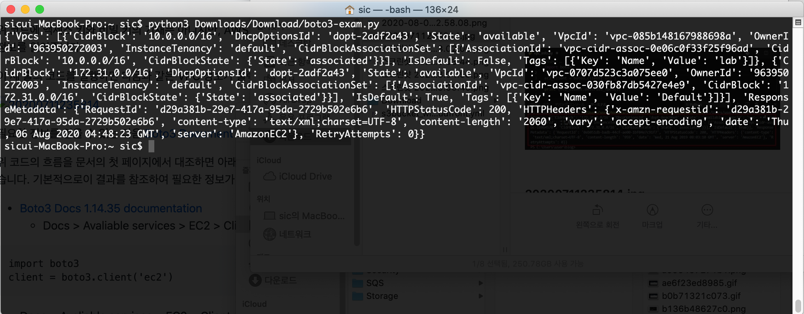
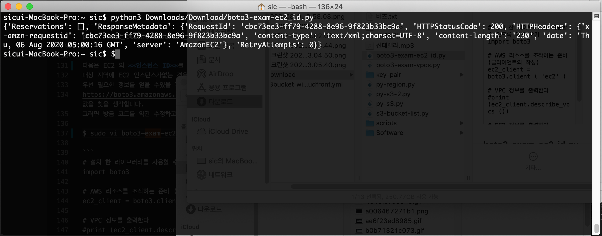

# [처음 Python3] boto3 를 사용하여 AWS를 사용해 봅니다.

AWS 에서 프로그래밍을 공부하는 데 이런 경험들

- 프로그래밍을 공부하고 싶지만, 왠지 어려울 것이라 더 이상 하지 않았다.
- 기술서 등의 내용이 어렵다 (갑자기 함수의 얘기도 잘 상상이되지 않는다)
- 기술 블로그를 볼 뿐 공식 문서를 볼 생각이 일어나지 않는다
- Hello World를 출력 해 보았지만, 이후부터는 어떻게 해야할지 모르겠다

따라서 이번에는 boto3 라는 라이브러리를 활용하여 가능한 한 간단하게 알기 쉽고, Python3 대해 전해 있으면이라고 생각합니다.

## 대상자
- AWS 및 AWS CLI를 경험이 적고 Python3 프로그래밍이 걱정되는 사람

## 이글의 개념
- 간단한 예제로 Python3를 코딩하여 AWS 리소스 사용을 쉽게 할 수 있도록 하는 것
- boto3 문서를 활용 방법

## 전제 조건
- Windows 10에서 AWS CLI 실행 환경
- MAC 에서 AWS CLI 실행 환경
- AWS EC2, Cloud9 환경에서 실행 환경
- Python3에서 Hello World를 출력 할 수있는 환경
    - 개인 편집기는 VS코드을 사용하지만, 각자 쉬운 편집기를 사용하세요.

## 목차
[1. Python3용 IAM 사용자 생성](#1-Python3용-IAM-사용자-생성)<br>
[2. Python3에서 AWS의 정보를 가져와 보자](#2-Python3에서-AWS의-정보를-가져와-보자)<br>
[3. Python3에서 정보를 쉽게 보기](#3-Python3에서-정보를-쉽게-보기)<br>
[4. 코드를 개선 해보자](#4-코드를-개선-해보자)<br>
[4. 마지막 정리](#4-마지막-정리)<br>

### 1. Python3용 IAM 사용자 생성
우선 아래 이미지에 따라 Python3을 움직이기위한 IAM 사용자를 만듭니다.
※ 이미 IAM 사용자가 있으면 사용 하셔도 상관 없습니다.

```
- AWS Magagement Console Login
  - IAM Dashboard
    - Groups > Group Name > Attach Policy > ReadOnlyAccess > Create
    - Users > User
      - Add user > User name
        - Access type
          - Programmatic access
          - AWS Management Console access
            - Console password > Next Permission
        - Add user to group > Select Group > Next Tags > Create user
    - Users > Select User > Security credentials
      - Access keys > Create access key > Download credential.csv
```

Terminal 에서 
$ **`aws configure`** 을 입력 한 후 **Access key** 와 **Secret Key** 를 입력합니다.<br>
$ **`aws configure list`** 명령을 실행하여 **Access key** 와 **Secret Key** 나오면 정상입니다.<br>
$ **`aws sts get-caller-identity`** 명령을 실행해서 자신의 IAM 사용자 정보가 나오면 정상입니다.<br>

```
$ aws configure

AWS Access Key ID [********************] : 키 입력
AWS Secret Access Key [********************] : 시크릿 키 입력
Default region name [ap-northeast-2] : 대상의 지역 명을 입력 ※ AWS 리소스가 아무것도 지역이라고 쉽다고합니다.
Default output format [None] : json/table/text 중에 입력
```

```
$ aws configure list
```

```
$ aws sts get-caller-identity

{
"UserId" : "foo" ,
"Account" : "hogehoge" ,
"Arn" : "arn : aws : iam : hogehoge : user / python3"
}
```

### 2. AWS의 정보를 Python3에서 가져 보자
시작으로 VPC 정보를 출력 해 봅니다.
Python3에서 AWS 환경을 조작하려면 boto3 라는 라이브러리가 필요합니다.
boto3 문서 : https://boto3.amazonaws.com/v1/documentation/api/latest/guide/quickstart.html
이 boto3 를 설치하고 Python3 코드에서 호출주는 것이 사용할 수있게됩니다.
우선 다음 명령을 실행하여 설치합니다.

```
$ pip install boto3
```

정상적으로 설치가 완료되면 임의의 폴더에 아래의 내용에 Python3 파일을 만듭니다.

```
sudo vi boto3-exam-vpcs.py

# 설치 한 라이브러리를 사용할 수 있도록 가져 오기
import boto3

# AWS 리소스를 조작하는 준비 (클라이언트의 작성)
ec2_client = boto3.client ( 'ec2' )

# VPC 정보를 출력한다
print (ec2_client.describe_vpcs ())
```

위 코드에 액세스 키와 비밀 키의 기재는 아니지만, AWS CLI를 사용하는 로컬 사용자 폴더 아래에있는 /.aws/config자 /.aws/credentials로부터 boto3가 인증 정보를 읽어줍니다.

이 세 줄의 코드를 실행하면 다음과 같은 VPC 정보가 출력됩니다.
※ 현재는 Default VPC 만 있습니다.



필요한 정보를 얻을 수 있는 다음 [Boto3 Document 페이지](https://boto3.amazonaws.com/v1/documentation/api/latest/index.html)에서 찾아 보겠습니다. 

위 코드의 흐름을 문서의 첫 페이지에서 대조하면 아래와 같이됩니다.이 페이지를 조금 아래로 스크롤하면 명령 실행시에 얻어지는 결과가 다음과 같이 기재되어 있습니다.
기본적으로이 결과를 참조하여 필요한 정보가 있는지 확인합니다.
만약 VPC ID를 취득하고자하는 경우에는 'VpcId'항목에서 찾아 보면 설명이 있군요!

- [Boto3 Docs 1.14.35 documentation](https://boto3.amazonaws.com/v1/documentation/api/latest/index.html/)
  - Docs > Avaliable services > EC2 > Client --> 다음 코드 복사합니다.

```
import boto3
client = boto3.client('ec2') 
```

  - Docs > Avaliable services > EC2 > Client > describe_vpcs() 

```
print (ec2_client.describe_vpcs ())
```

다음은 EC2 의 **인스턴스 ID**를 가져 보려고 생각합니다.
대상 지역에 EC2 인스턴스가없는 경우에는 적당한 것을 하나 만들어주세요.
우선 필요한 정보를 얻을 수있을 것 같은 명령을 다음 페이지에서 찾아 보겠습니다.
https://boto3.amazonaws.com/v1/documentation/api/latest/reference/services/ec2.html#client 하면 다음과 같은 흐름에서 원하는 값을 찾을 생각합니다.
그러면 방금 코드를 약간 수정하고 실행 해 봅니다.

```
$ sudo vi boto3-exam-ec2_id.py

# 설치 한 라이브러리를 사용할 수 있도록 가져 오기
import boto3

# AWS 리소스를 조작하는 준비 (클라이언트의 작성)
ec2_client = boto3.client ( 'ec2' )

# VPC 정보를 출력한다
#print (ec2_client.describe_vpcs ())

# EC2 정보를 출력한다
print (ec2_client.describe_instances ())
```



위와 같은 코드 로 실행을 하면 출력 정보에 인스턴스 ID가 나올 것입니다.
그러나 이것으로는 필요없는 정보가 너무 많습니다. 어떻게 든하고 싶은 곳입니다.

## 3. Python3에서 정보를 쉽게 보기
아무것도 지정하지 않고 명령을 실행하는 것만으로는 원하는 정보를 얻을 수있는 무슨을보기 힘듭니다.
어떻게 든 인스턴스 ID만을 출력하고 싶을 것입니다.
그런 경우에는 다음과 같이 필요한 정보 만 제공합니다.

```
sudo vi boto3-exam-ec2_id-2.py

# 설치 한 라이브러리를 사용할 수 있도록 가져 오기
import boto3

# AWS 리소스를 조작하는 준비 (클라이언트의 작성)
ec2_client = boto3.client ( 'ec2' )

# VPC 정보를 출력한다
print (ec2_client.describe_vpcs ())

# 인스턴스 ID를 출력한다
print (ec2_client.describe_instances()['Reservations'][0]['Instances'][0]['InstanceId'])
```

마지막 행에 주목하면, ec2_client.describe_instances()명령 후에 여러가지 붙어있는 것을 알 수 있습니다.

굳이 이런 방법으로  코드를 작성하는 이유는 인스턴스 ID 정보만 필요할 경우 하나만 출력되는 하려는 것입니다.

여기서 다시 boto3 문서는 반환 항목을 확인하려고합니다.

이것은 반환 값의 형태입니다.
dect 형이라는 것은 Key와 Value가 결합 된 데이터 형의 1 종에서 Key를 지정해 호출하여 Value를 얻을 수 있습니다. (AWS 리소스에 붙이는 태그를 떠올려 주시면이라고 생각합니다.)

이 코드는 다음과 같이 생각하면 인스턴스 ID 정보까지 도착할 수 있습니다.
이번엔 [0]니 듣지 않아! 이 있군요. (초보자 시절의 저라면 ... 중략)

이곳은 list 형을 호출하는 것으로되어 있으며, list에있는 첫 번째 데이터를 지정하고 있습니다.
list 형이라는 것은 여러 데이터를 그룹화 할 수있는 데이터 형식입니다.
list 내의 데이터의 위치를 [0]や[5]지정하여주는 것이 첫 번째와 6 번째 데이터를 검색 할 수 있습니다.

이번 예이며, EC2 인스턴스는 여러 대의 작성되는 것이 대부분 아닐까 생각됩니다.
그 여러 대있는 EC2 인스턴스의 정보를 반환 값에서 list 형식으로, 한 덩어리로 된 상태에서 받고있는 것으로 있습니다.

즉, ['Reservations'][0]['Instances'][0]['InstanceId']의미는
'Reservations'Key의 첫 번째 Value에있는 'Instances'Key의 첫 번째 Value의 'InstanceId'Key를 지정하고 있습니다.
결과 'InstanceId'Key의 Value = 인스턴스 ID 만 출력됩니다.

## 4. 코드를 개선 해보자

```
print (ec2_client.describe_instances()['Reservations'][0]['Instances'][0]['InstanceId'])
```

이 한 줄 우리 인류는 부드럽게 않 지요.
어수선하고 있으며, list 형의 첫 번째 데이터 밖에 출력되지 않습니다. 두 번째 데이터를 출력하기 위해 손으로 [1]로 바꾸 번거 로움입니다.
데이터가 1000 개 있으면 0에서 999까지 써야 없습니다 (^ ω ^) ···.

따라서 초보자하면서도 맹목적으로 코드를 써가는 것으로, 다양한 문제점이 대두되고 있습니다.
바로 해결하다 보면 다음과 같습니다.

```
sudo vi boto3-exam-ec2_id-3.py

# 설치 한 라이브러리를 사용할 수 있도록 가져 오기
import boto3

# AWS 리소스를 조작하는 준비 (클라이언트의 작성)
ec2_client = boto3.client ( 'ec2' )

# Describe 결과를 변수에 저장
ec2_data = ec2_client.describe_instances ()

# ec2_data ['Reservations']의 list를 하나씩 꺼내
for reservation in ec2_data ['Reservations'] :

    # reservation ['Instances']의 list를 하나씩 꺼내
    for instance in reservation ['Instances'] :

        # 위에서 추출 된 데이터의 인스턴스 ID를 출력한다
        print (instance ['InstanceId'])
```

for 문이라는 문법을 사용하여 정리된 데이터를 하나씩 검색 할 수 있습니다.
이 코드는 지정된 지역의 모든 인스턴스 ID가 출력됩니다.

```
print (ec2_client.describe_instances()['Reservations'][0]['Instances'][0]['InstanceId'])
```

여기에 위의 코드에서 어떻게 바뀌 었는지를 문장으로 설명하면, ec2_client.describe_instances()명령의 반환 값이 변수 ec2_data에 저장되어 ec2_client.describe_instances()['Reservations']라고 기재하고 있던 것이 ec2_data['Reservations']되어, for 문에서 하나씩 데이터를 검색 있습니다.

for 문에서 ec2_data['Reservations']의 list 형 데이터가 하나의 변수 reservation에 저장되며 그 중 for 문에서 reservation['Instances']로 list 형 데이터가있는 EC2 인스턴스의 정보를 변수 instance에 저장합니다.

이렇게 계층을 파고 갔다 앞으로, instance['InstanceId']그리고 지정하여주는 것이 인스턴스 ID가 출력됩니다. 이처럼 인스턴스 ID를 출력 할 수있게되면 EC2를 시작 / 중지 함수에 인스턴스 ID를 전달하고 연계 할 수도 있습니다.(EC2를 시작 / 중지 명령은 같은 요령으로 찾으면 바로 찾을 수 있습니다.)

원래 특정 인스턴스 ID 만 표시되는 상황이라면, boto3 문서를 참고 ec2_client.describe_instances()의 () 내를 만져 보거나 같은 수의 폭이 넓어 오는 것이 아닐까 생각됩니다.

## 5. 마지막 정리
이 글에서 전달하고 싶은 내용은 Boto3 Document 를 보면서 코드 를 전개하고자 할 때 어떻게 하면 좋은 지의 경험을 공유하고자 하는 것입니다.
