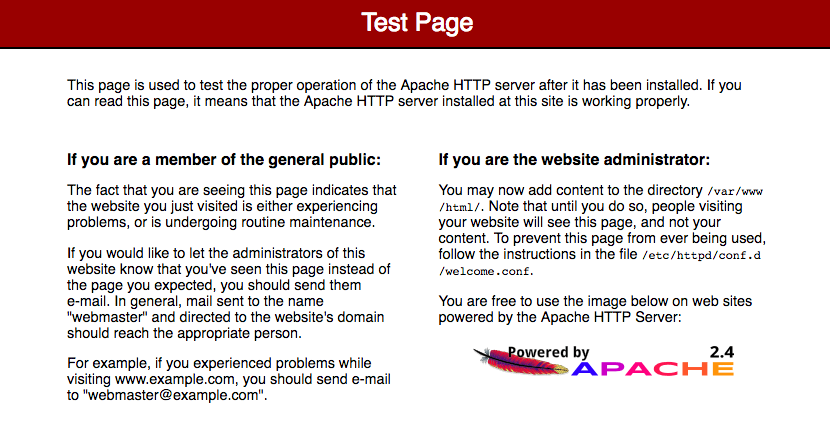
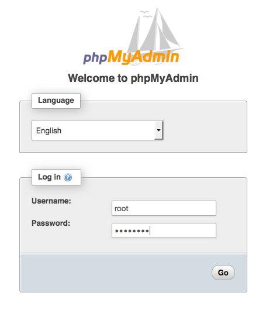

# 자습서: Amazon Linux 2에 LAMP 웹 서버 설치

다음 절차를 통해 Amazon Linux 2 인스턴스에서 PHP 및 MariaDB(커뮤니티에서 개발한 MySQL 포크) 지원을 포함하는 Apache 웹 서버를 설치할 수 있습니다. 이 웹 서버를 LAMP 웹 서버 또는 LAMP 스택이라고도 합니다. 이 서버를 사용해서 고정 웹사이트를 호스팅하거나 데이터베이스에서 정보를 읽고 쓰는 동적 PHP 애플리케이션을 배포할 수 있습니다.

```
중요
Ubuntu 또는 Red Hat Enterprise, Linux와 같은 다른 배포에서 LAMP 웹 서버를 설정하려는 경우 이 자습서를 이용할 수 없습니다. Amazon Linux AMI의 경우 자습서: Amazon Linux AMI에 LAMP 웹 서버 설치 섹션을 참조하세요. Ubuntu의 경우 Ubuntu 커뮤니티 설명서 ApacheMySQLPHP를 참조하세요. 다른 배포는 관련 설명서를 참조하세요.
```

## 작업

[1단계: LAMP 서버 준비](#1단계-LAMP-서버-준비)  
[2단계: LAMP 서버 테스트](#2단계-LAMP-서버-테스트)  
[3단계: 데이터베이스 서버 보안 설정](#3단계-데이터베이스-서버-보안-설정)  
[4단계: 선택 사항-phpMyAdmin 설치](#4단계-선택-사항-phpMyAdmin-설치)  

## 1단계: LAMP 서버 준비
사전 조건

- 본 자습서는 Amazon Linux 2를 사용하여 사용자가 인터넷에서 접근할 수 있는 퍼블릭 DNS 이름을 가진 새 인스턴스를 이미 실행한 것으로 가정하고 있습니다. 자세한 내용은 1단계: 인스턴스 시작 단원을 참조하세요. SSH(포트 22), HTTP(포트 80), HTTPS(포트 443) 연결을 허용할 수 있도록 보안 그룹을 구성해야 합니다. 이 사전 요구 사항에 대한 자세한 내용은 Linux 인스턴스의 인바운드 트래픽 권한 부여 단원을 참조하십시오.

- 다음 절차는 Amazon Linux 2에서 사용할 수 있는 최신 PHP 버전(PHP 7.2)을 설치합니다. 이 자습서에서 명시한 애플리케이션이 아닌 PHP 애플리케이션을 사용하려는 경우 PHP 7.2와의 호환성을 확인해야 합니다.

LAMP 서버를 준비하려면

1. 인스턴스에 연결합니다.

2. 모든 소프트웨어 패키지가 최신 상태로 업데이트되어 있는지 확인하기 위해, 인스턴스에서 퀵 소프트웨어 업데이트를 실행합니다. 이 업데이트 과정은 몇 분 정도 시간이 소요될 수 있지만, 최신 보안 업데이트와 버그 수정을 위해 수행할 필요가 있습니다.

-y 옵션을 사용하면 확인 여부를 묻지 않고 업데이트를 설치합니다. 설치 전에 업데이트 정보를 확인하려면 이 옵션을 생략합니다.

```
[ec2-user ~]$ sudo yum update -y
```

3. lamp-mariadb10.2-php7.2 및 php7.2 Amazon Linux Extras 리포지토리를 설치하여 Amazon Linux 2용 LAMP MariaDB 및 PHP 패키지의 최신 버전을 가져옵니다.

```
[ec2-user ~]$ sudo amazon-linux-extras install -y lamp-mariadb10.2-php7.2 php7.2
```

sudo: amazon-linux-extras: command not found 오류가 발생하면 인스턴스가 Amazon Linux 2 AMI로 실행되지 않은 것입니다(Amazon Linux AMI를 사용하고 있는 것일 수 있음). 다음 명령을 사용하여 Amazon Linux 버전을 볼 수 있습니다.

```
[ec2-user ~]$ cat /etc/system-release
```

4. 이제 인스턴스가 최신 상태이므로 Apache 웹 서버, MariaDB, PHP 소프트웨어 패키지를 설치할 수 있습니다.

yum install 명령을 사용하여 여러 소프트웨어 패키지와 모든 관련 종속 프로그램을 동시에 설치합니다.

```
[ec2-user ~]$ sudo yum install -y httpd mariadb-server
```

다음 명령을 사용하여 이러한 패키지의 현재 버전을 볼 수 있습니다.

```
[ec2-user ~]$ yum info package_name
```

5. Apache 웹 서버를 시작합니다.

```
[ec2-user ~]$ sudo systemctl start httpd
```

6. systemctl 명령을 사용하여 Apache 웹 서버가 매번 시스템이 부팅할 때마다 시작되도록 합니다.

```
[ec2-user ~]$ sudo systemctl enable httpd
```

다음 명령을 실행하여 httpd가 실행되고 있는지 확인할 수 있습니다.

```
[ec2-user ~]$ sudo systemctl is-enabled httpd
```

7. 인스턴스에 대해 인바운드 HTTP(포트 80) 연결을 허용하는 보안 규칙이 없는 경우 추가합니다. 기본적으로 초기화 중에 인스턴스에 대해 launch-wizard-N 보안 그룹이 설정됩니다. 이 그룹에는 SSH 연결을 허용하는 규칙이 한 개 들어 있습니다.

- https://console.aws.amazon.com/ec2/에서 Amazon EC2 콘솔을 엽니다.

- 인스턴스를 선택하고 해당 인스턴스를 선택합니다.

- 보안 탭에서 인바운드 규칙을 확인합니다. 다음과 같은 규칙이 표시되어야 합니다.

```
Port range   Protocol     Source
22           tcp          0.0.0.0/0
```

- 보안 그룹에 대한 링크를 선택합니다. 보안 그룹에 규칙 추가의 절차를 사용하여 다음 값으로 새로운 인바운드 보안 규칙을 추가합니다.

  - 유형: HTTP

  - 프로토콜: TCP

  - 포트 범위: 80

  - 소스: 사용자 지정

8. 웹 서버를 테스트합니다. 웹 브라우저에서 인스턴스의 공용 DNS 주소(또는 공용 IP 주소)를 입력합니다. /var/www/html에 콘텐츠가 없으면 Apache 테스트 페이지가 표시됩니다. Amazon EC2 콘솔을 사용하여 인스턴스의 퍼블릭 DNS를 확인할 수 있습니다. 퍼블릭 DNS 열을 확인합니다. 이 열이 숨겨진 경우 열 표시/숨기기 아이콘(기어 모양 아이콘)을 선택하고 퍼블릭 DNS를 선택합니다.

인스턴스의 보안 그룹에 포트 80에서 HTTP 트래픽을 허용하는 규칙이 포함되어 있는지 확인합니다. 자세한 내용은 보안 그룹에 규칙 추가 단원을 참조하십시오.

중요
Amazon Linux을 사용하지 않는 경우, 이러한 연결을 허용하도록 인스턴스의 방화벽을 구성할 필요가 있습니다. 방화벽 구성 방법에 대한 자세한 내용은 사용자의 특정 배포에 대한 문서를 참조하십시오.



Apache httpd는 Apache document root라는 디렉터리에 보관된 파일을 처리합니다. Amazon Linux Apache 문서 루트는 /var/www/html이며, 기본적으로 루트에서 소유합니다.

ec2-user 계정에서 이 디렉터리의 파일을 조작할 수 있게 하려면 디렉터리의 소유권과 권한을 변경해야 합니다. 이 작업을 수행하는 방법에는 여러 가지가 있습니다. 본 자습서에서는 ec2-user를 apache 그룹에 추가하여 apache 그룹에 /var/www 디렉터리의 소유권을 부여하고 쓰기 권한을 할당합니다.

파일 권한 설정

1. 사용자(이 경우는 ec2-user)를 apache 그룹에 추가합니다.

```
[ec2-user ~]$ sudo usermod -a -G apache ec2-user
```

2. 로그아웃하고 다시 로그인한 다음, 새 그룹을 선택하고 멤버십을 확인합니다.

  - 로그아웃합니다(exit 명령을 사용하거나 터미널 창 닫기).

```
[ec2-user ~]$ exit
```

  - apache 그룹의 멤버십을 확인하려면 인스턴스에 다시 연결한 후 다음 명령을 실행합니다.

```
[ec2-user ~]$ groups
ec2-user adm wheel apache systemd-journal
```

3. /var/www 및 그 콘텐츠의 그룹 소유권을 apache 그룹으로 변경합니다.

```
[ec2-user ~]$ sudo chown -R ec2-user:apache /var/www
```

4. 그룹 쓰기 권한을 추가하여 나중에 하위 디렉터리에 대한 그룹 ID를 설정하려면 /var/www와 그 하위 디렉터리의 디렉터리 권한을 변경합니다.

```
[ec2-user ~]$ sudo chmod 2775 /var/www && find /var/www -type d -exec sudo chmod 2775 {} \;
```

5. 그룹 쓰기 권한을 추가하려면 /var/www 및 그 하위 디렉터리의 파일 권한을 반복하여 변경합니다.

```
[ec2-user ~]$ find /var/www -type f -exec sudo chmod 0664 {} \;
```

이제 ec2-user와 apache 그룹의 향후 멤버는 Apache document root에서 파일 추가, 삭제, 편집을 할 수 있고, 이를 통해 사용자는 정적 웹 사이트 또는 PHP 애플리케이션과 같은 콘텐츠를 추가할 수 있습니다.

웹 서버를 보호하려면(선택 사항)

HTTP 프로토콜을 실행하는 웹 서버는 송신하거나 수신하는 데이터에 대해 아무런 전송 보안 기능도 제공하지 않습니다. 웹 브라우저를 사용하여 HTTP 서버에 연결할 때 방문하는 URL, 수신하는 웹 페이지의 내용, 제출하는 HTML 양식의 내용(암호 포함)이 모두 네트워크 경로를 따라 어디서든 엿보려는 사람들에게 보입니다. 웹 서버를 안전하게 보호하기 위한 최선의 방법은 SSL/TLS 암호화로 데이터를 보호하는 HTTPS(HTTP Secure) 지원 기능을 설치하는 것입니다.

## 2단계: LAMP 서버 테스트
서버가 설치되어 실행 중이고 파일 권한이 올바르게 설정되었다면 사용자의 ec2-user 계정을 통해 인터넷에서 사용 가능한 /var/www/html 디렉터리에서 PHP 파일을 생성할 수 있어야 합니다.

LAMP 서버를 테스트하려면

1. Apache 문서 루트에서 PHP 파일을 생성합니다.

```
[ec2-user ~]$ echo "<?php phpinfo(); ?>" > /var/www/html/phpinfo.php
```

이 명령을 실행하는 동안 "Permission denied" 오류가 발생하면, 로그아웃하고 다시 로그인한 다음, 파일 권한 설정에서 구성한 적절한 그룹 권한을 선택합니다.

2. 웹 브라우저에서는 방금 생성한 파일의 URL을 입력합니다. 이 URL은 인스턴스의 퍼블릭 DNS 주소에 슬래시(/)와 파일 이름이 추가된 형태입니다. 다음 예를 참조하십시오.

http://my.public.dns.amazonaws.com/phpinfo.php
PHP 정보 페이지가 표시되어야 합니다:


이 페이지가 보이지 않을 경우 이전 단계에서 /var/www/html/phpinfo.php 파일이 제대로 생성되었는지 확인하십시오. 또한 다음 명령을 사용하여 필수 패키지가 모두 설치되었는지도 확인할 수 있습니다.

```
[ec2-user ~]$ sudo yum list installed httpd mariadb-server php-mysqlnd
```

출력에서 필요한 패키지가 하나라도 나열되지 않으면, sudo yum install package 명령을 사용하여 패키지를 설치합니다. php7.2 및 lamp-mariadb10.2-php7.2 extra가 amazon-linux-extras 명령의 출력에서 활성화되는지도 확인합니다.

3. phpinfo.php 파일을 삭제합니다. 이 파일은 유용한 정보를 포함하고 있지만 보안상 이유로 인터넷에 공개되어서는 안 됩니다.

```
[ec2-user ~]$ rm /var/www/html/phpinfo.php
```

이제 LAMP 웹 서버가 완전히 동작하는 상태가 됩니다. /var/www/html의 Apache document root에 콘텐츠를 추가하면 인스턴스에 대한 퍼블릭 DNS 주소에서 그 콘텐츠를 볼 수 있습니다.

## 3단계: 데이터베이스 서버 보안 설정
MariaDB 서버의 기본 설치는 테스트 및 개발 기능에 유용한 여러 기능을 포함하고 있지만, 이 기능들은 프로덕션 서버에서는 비활성화되거나 제거되어야 합니다. mysql_secure_installation 명령을 통해 루트 암호를 설정하고 설치 패키지에서 보안성이 낮은 기능을 제거하는 과정을 수행할 수 있습니다. MariaDB 서버를 사용할 계획이 없더라도 이 절차를 수행하는 것이 좋습니다.

MariaDB 서버의 보안을 유지하려면

1. MariaDB 서버를 시작합니다.

```
[ec2-user ~]$ sudo systemctl start mariadb
```

2. 실행 mysql_secure_installation.

```
[ec2-user ~]$ sudo mysql_secure_installation
```

  - 암호를 입력하라는 메시지가 표시되면 루트 계정의 암호를 입력합니다.

  - 현재 루트 암호를 입력합니다. 기본적으로 root 계정에는 암호가 없습니다. Enter를 누릅니다.

  - 암호를 설정하려면 Y를 누른 후 안전한 암호를 두 번 입력합니다. 보안 암호 생성에 대한 자세한 내용은 https://identitysafe.norton.com/password-generator/ 단원을 참조하십시오. 이 암호를 안전한 장소에 보관하시기 바랍니다.

  - MariaDB에 대한 루트 암호를 설정하는 것은 데이터베이스를 보호하는 가장 기초적인 방법일 뿐입니다. 데이터베이스 기반 애플리케이션을 빌드하거나 설치할 때, 일반적으로 그 애플리케이션의 데이터베이스 서비스 사용자를 만들고 데이터베이스 관리 이외의 어떤 목적으로도 루트 계정을 사용하지 못하게 합니다.

  - Y를 눌러서 익명 사용자 계정을 제거합니다.

  - Y를 입력하여 원격 루트 로그인을 비활성화합니다.

  - Y를 눌러서 테스트 데이터베이스를 제거합니다.

  - Y를 눌러서 권한 테이블을 다시 로드하고 변경사항을 저장합니다.

3. (선택 사항) 지금 바로 사용할 계획이 아니라면 MariaDB 서버를 중지합니다. 필요할 때 다시 시작할 수 있습니다.

```
[ec2-user ~]$ sudo systemctl stop mariadb
```

4. (선택 사항) 부팅 시 MariaDB 서버가 시작되도록 하려면 다음 명령을 입력합니다.

```
[ec2-user ~]$ sudo systemctl enable mariadb
```

## 4단계: 선택 사항-phpMyAdmin 설치
-->

## 선택 사항-phpMyAdmin 설치
phpMyAdmin은 EC2 인스턴스의 MySQL 데이터베이스를 보고 편집하는 데 사용할 수 있는 웹 기반 데이터베이스 관리 도구입니다. Amazon Linux 인스턴스에서 phpMyAdmin을 설치 및 구성하려면 다음 단계를 따르십시오.

```
중요
Apache에서 SSL/TLS를 활성화하지 않은 경우 phpMyAdmin을 사용하여 LAMP 서버에 액세스하지 않는 것이 좋습니다. 이 상태에서 액세스하면 데이터베이스 관리자 암호와 기타 데이터가 인터넷을 통해 안전하지 못한 상태로 전송됩니다. 개발자의 보안 권장 사항을 보려면 phpMyAdmin 설치 보안을 참조하십시오.
```

phpMyAdmin을 설치하려면

1. 필요한 종속 항목을 설치합니다.

```
[ec2-user ~]$ sudo yum install php-mbstring php-xml -y
```

2. Apache를 다시 시작합니다.

```
[ec2-user ~]$ sudo systemctl restart httpd
```

3. php-fpm을 다시 시작합니다.

```
[ec2-user ~]$ sudo systemctl restart php-fpm
```

4. Apache 문서 루트(/var/www/html)로 이동합니다.

```
[ec2-user ~]$ cd /var/www/html
```

5. https://www.phpmyadmin.net/downloads에서 phpMyAdmin 최신 릴리스의 소스 패키지를 선택합니다. 인스턴스로 파일을 직접 다운로드하려면 다음 예제와 같이 링크를 복사한 후 wget 명령에 붙여 넣습니다.

```
[ec2-user html]$ wget https://www.phpmyadmin.net/downloads/phpMyAdmin-latest-all-languages.tar.gz
```

6. phpMyAdmin 폴더를 생성하고 다음 명령을 사용하여 해당 폴더로 패키지의 압축을 풉니다.

```
[ec2-user html]$ mkdir phpMyAdmin && tar -xvzf phpMyAdmin-latest-all-languages.tar.gz -C phpMyAdmin --strip-components 1
```

7. phpMyAdmin-latest-all-languages.tar.gz tarball을 삭제합니다.

```
[ec2-user html]$ rm phpMyAdmin-latest-all-languages.tar.gz
```

8. (선택 사항) MySQL 서버가 실행 중이지 않으면 지금 시작합니다.

```
[ec2-user ~]$ sudo systemctl start mariadb
```

9. 웹 브라우저에서 phpMyAdmin 설치의 URL을 입력합니다. 아래의 예와 같이 이 URL은 인스턴스의 퍼블릭 DNS 주소(또는 퍼블릭 IP 주소)에 슬래시(/)와 설치 디렉터리의 이름이 추가된 형태입니다. 다음 예를 참조하십시오.

```
http://my.public.dns.amazonaws.com/phpMyAdmin
```

사용자는 phpMyAdmin 로그인 페이지를 볼 수 있어야 합니다:



10. 앞서 만든 root 사용자 이름 및 MySQL 루트 암호로 phpMyAdmin 설치에 로그인합니다.

작동하려면 먼저 설치를 구성해야 합니다. 먼저 다음과 같이 구성 파일을 수동으로 작성하는 것이 좋습니다.

  - 최소 구성 파일로 시작하려면 자주 사용하는 텍스트 편집기를 사용하여 새 파일을 생성한 후에 config.sample.inc.php 내용을 파일에 복사합니다.

  - 이 파일을 index.php가 포함된 phpMyAdmin 디렉토리에 config.inc.php로 저장하십시오.

  - 추가 설정에 대해서는 phpMyAdmin 설치 지침에서 설정 스크립트 사용 단원의 파일 생성 후 지침을 참조하세요.

phpMyAdmin에 대한 자세한 내용은 phpMyAdmin 사용 설명서를 참조하십시오.

## Apache BenchMark 부하테스트
마지막으로 명령 줄로 이동하여 Apache Bench를 사용하여 각각의 새 인스턴스에 큰 부하를 보냅니다. 
최대 10 개의 요청을 동시에 실행하면서 100 개의 요청을 처리 할 수 ​​있는지 확인하기 위해 다음을 입력했습니다.

### 설치

```
$ sudo yum install -y httpd24-tools
```

다음 명령을 실행하여 로드 밸런서의 DNS 이름을 대체합니다.

```
$ ab -n 100000 -c 1000 http://EC2Contai-EcsElast-SMAKV74U23PH-96652279.us-east-1.elb.amazonaws.com/
```

https://console.aws.amazon.com/cloudwatch/에서 CloudWatch 콘솔을 엽니다.

왼쪽 탐색 창에서 경보(Alarms)를 선택합니다.

ab HTTP 요청이 CloudWatch 콘솔에서 확장 경보를 트리거할 때까지 기다립니다. Amazon ECS 서비스가 확장되고 원하는 서비스 수에 하나의 작업이 추가되는 것이 보여야 합니다.

ab HTTP 요청이 완료된 직후(1분에서 2분 사이) 축소 경보가 트리거되고 축소 정책이 원하는 서비스 수를 다시 1로 줄입니다.

```
ab -n 100 -c 10 http://IPaddress/
ab -n 100 -c 10 http://IPaddress/
ab -n 100 -c 10 http://IPaddress/
```