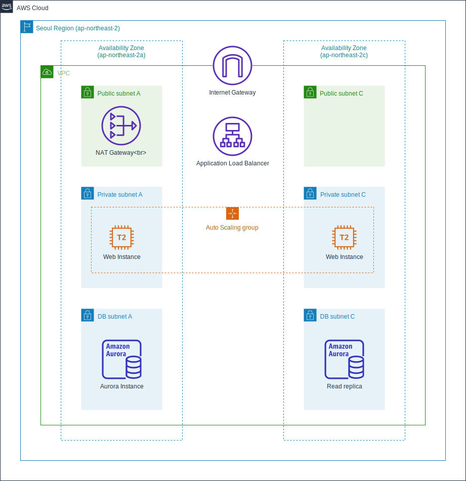

# 데이터베이스 – Amazon Aurora
AWS에서 사용하실 수 있는 여러 Database 옵션 중, Amazon RDS(Relational Database Service)는 구성과 운영이 간편하고 확장이 손쉬운 클라우드 기반의 데이터베이스 서비스입니다. Amazon RDS는 비용 효율적이고 손쉽게 용량을 조절할 수 있으며, 시간 소모가 많은 관리 작업을 줄여 사용자가 비지니스와 어플리케이션에 보다 집중할 수 있게 합니다.

## 목표 구성도
본 Database 실습은 VPC-Lab 내에 RDS Aurora 인스턴스를 배포하고, 이미 생성된 Auto Scaling Group 내 인스턴스의 Web Service(Apache+PHP)가 RDS Aurora(MySQL)를 사용할 수 있도록 구성합니다. 데이터베이스와의 연결 설정이 완료되면, 기존 커스텀 AMI의 새로운 버전을 생성하고, Auto Scaling Group에서 새로운 AMI를 사용하도록 업데이트 합니다. 그리고 Web Browser를 통하여 RDS DB에 저장된 단순한 주소록에 연락처를 추가/수정/삭제 하는 테스트를 진행해 봅니다.

## 실습 순서
본 Lab은 다음과 같은 순서로 진행됩니다.

- VPC 보안 그룹 생성

- RDS 인스턴스 생성

- RDS 크레덴셜 저장하기

- 웹앱 서버와 RDS 연결

- (옵션) RDS 관리 기능

- 도전 과제 - RDS Aurora 연결

<!-- [Previous](./compute/40-appendix.md) | [Next](./database/create-sg.md)